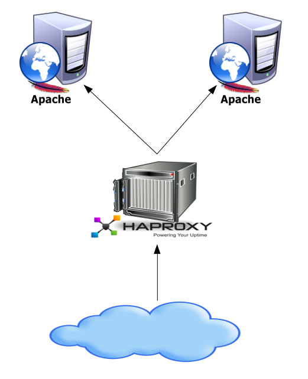
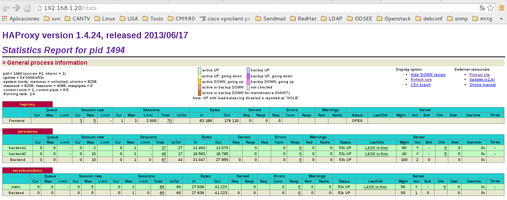

## Balance de carga con HAProxy

[HAProxy](http://www.haproxy.org/ "http://www.haproxy.org/") es una solución gratuita , muy rápido y fiable que ofrece alta disponibilidad , balanceo de carga y el proxy para TCP y aplicaciones basadas en HTTP. Es especialmente adecuado para los sitios web de muy alto tráfico y las más visitadas del mundo. Con los años se ha convertido en el software balanceador de carga favorito de las distribuciones GNU/Linux, ahora se incluye con la mayoría de las distribuciones de Linux y con frecuencia se despliega por defecto en plataformas en la nube. [HAProxy](http://www.haproxy.org/ "http://www.haproxy.org/") no se hace publicidad, sólo se sabe cuando los administradores informan de ella :-)

Algo que se debe tomar en cuenta es: En Seguridad - Ni siquiera una intrusión en 13 años.
 
### Plataforma soportada
- Linux 2.4 on x86, x86_64, Alpha, Sparc, MIPS, PARISC
- Linux 2.6 / 3.x on x86, x86_64, ARM, Sparc, PPC64
- Solaris 8/9 on UltraSPARC 2 and 3
- Solaris 10 on Opteron and UltraSPARC
- FreeBSD 4.10 - 10 on x86
- OpenBSD 3.1 to -current on i386, amd64, macppc, alpha, sparc64 and VAX (check the ports)
- AIX 5.1 - 5.3 on Power™ architecture 

Hay 3 factores importantes que se utilizan para medir el rendimiento de un balanceador de carga:
- [The session rate](http://www.haproxy.org/ "http://www.haproxy.org/")
- [The session concurrency](http://www.haproxy.org/ "http://www.haproxy.org/")
- [The data forwarding rate](http://www.haproxy.org/ "http://www.haproxy.org/")
 

[HAProxy](http://www.haproxy.org/ "http://www.haproxy.org/") soluciona la sobrecarga de los servidores. Puede balancear cualquier protocolo.

Si [HAProxy](http://www.haproxy.org/ "http://www.haproxy.org/") detecta la caída de algun servicio o servidor, puede optar por no enviarle más peticiones.

[HAProxy](http://www.haproxy.org/ "http://www.haproxy.org/") no es un cluster o HA. Para eso lo puede integrar con keepalived, hearbeat, corosyn y pacemaker

Con [HAProxy](http://www.haproxy.org/ "http://www.haproxy.org/") vamos a  distribuir las peticiones de los clientes de forma equitativa entre distintos servidores de "backend" (termino muy utilizado por HAProxy). Un   servidor backend: puede ser servidor web, que reciba las solicitudes del frontend (termino muy utilizado por HAProxy). Un frontend se le llama al [HAProxy](http://www.haproxy.org/ "http://www.haproxy.org/") que atendera las solicitudes de los clientes y se las envia a los backends.

Con [HAProxy](http://www.haproxy.org/ "http://www.haproxy.org/") puede detectar la carga de los backends y distribuir las peticiones de forma equitativa para evitar sobrecarga. También nosotros le podemos indicar cual sera el porcentaje de carga para los backends. Este mecanismo también se utiliza para identificar si un backend esta fuera de servicio y de esta forma no se le envía peticiones.

Una forma de balancear muy simple y económica es Roundrobin por DNS, pero esto no esta bien cuando se tiene altas cargas de peticiones y se requiere una mínima perdida de peticiones, es decir, un balanceador puede tener en cuenta la carga de cada backend y distribuir las peticiones según la carga que tenga el backend, mientras que al Roundrobin por DNS no tiene en cuenta la carga de los backends y por lo tanto se envían paquetes que comienzan a producir time outs y lentitud. Además, si un backend queda inoperativo el Roundrobin por DNS no sera capaz de identificar esto y se producirán nuevamente perdida de paquetes, time outs y lentitud.

Algo que gusta mucho de [HAProxy](http://www.haproxy.org/ "http://www.haproxy.org/"), pueden mantener las sesiones de los usuarios, de forma que un usuario que inicia sesión en un backend "A" siempre sera dirigido por el [HAProxy](http://www.haproxy.org/ "http://www.haproxy.org/") al mismo backend "A". El Roundrobin por DNS no es capaz de mantener sesiones, por lo que siempre el usuario pierde la sesión.

En este laboratorio solo vamos a instalar un solo frontend [HAProxy](http://www.haproxy.org/ "http://www.haproxy.org/"), que haga balanceo de carga y distribuya las solicitudes de HTTP hacia dos backends, que verifique si alguno de los backends esta inoperativo y que por supuesto puede identificar las sesiones de los usuarios y sean redireccionados nuevamente al backend que le esta atendiendo dicha sesión.



En resumen esto es lo que vamos a tener con [HAProxy](http://www.haproxy.org/ "http://www.haproxy.org/"):
- Sobre carga en los backends, para balancear los recursos entre ellos.
- Detectar backend caídos, para no utilizarlo.
- Identificación sesiones, para conservar las sesiones.
- Algoritmos de balanceo, para elegir entre balance Roundrobin, por peso, por origen, etc.
- Escalabilidad, para que sea fácil adicionar más backend.
- ACLs por tipo de contenido, nombre de dominio, etc., para filtrar contenido, o dirigir las peticiones por contenido estático a un servidor en particular, etc.
 
## Como estará configurado el laboratorio

- 192.168.1.20 -- Ubuntu 14.04.4, haproxy -- HAProxy 1.4
- 192.168.1.21 -- Ubuntu 14.04.4, backend1 -- apache2, php5
- 192.168.1.22 -- Ubuntu 14.04.4, backend2 -- apache2, php5
- 192.168.1.23 -- Ubuntu 14.04.4, backend3 -- apache2

#### Configuración del servidor HAProxy

Configuremos la interfaz de red (Importante que este como adaptador puente)
```
	# vi /etc/network/interfaces
	# The loopback network interface
	auto lo
	iface lo inet loopback

	# The primary network interface
	auto eth0
	iface eth0 inet static
	address 192.168.1.20
	netmask 255.255.255.0
	gateway 192.168.1.1
	dns-nameserver 192.168.1.1
```
Creamos unos registros en el hosts
```
	# echo -e "
	  192.168.1.20	haproxy
	  192.168.1.21	backend1
	  192.168.1.22	backend2" >> /etc/hosts

```

Luego procedemos a instalar los paquetes requeridos
```
 # apt-get update && apt-cache install haproxy openssh-server -y
```

Habilitamos el HAProxy
```
	# vi /etc/default/haproxy
	ENABLED=1
```

Editamos el archivo de configuración
```
	# vi /etc/haproxy/haproxy.cfg
	global
		log /dev/log	local0
		log /dev/log	local1 notice
		maxconn 4096
		chroot /var/lib/haproxy
		user haproxy
		group haproxy
		daemon

	defaults
		log	global
		mode	http
		option	httplog
		option	dontlognull
		retries	3
		option redispatch
		maxconn 2000
		contimeout 5000
		clitimeout 50000
		srvtimeout 50000
		errorfile 400 /etc/haproxy/errors/400.http
		errorfile 403 /etc/haproxy/errors/403.http
		errorfile 408 /etc/haproxy/errors/408.http
		errorfile 500 /etc/haproxy/errors/500.http
		errorfile 502 /etc/haproxy/errors/502.http
		errorfile 503 /etc/haproxy/errors/503.http
		errorfile 504 /etc/haproxy/errors/504.http
		stats enable
		stats uri /stats
		stats realm HAProxy\ Statistics
		stats auth admin:Venezuela21  #Coloca aquí el usuario y clave que quieras

	frontend haproxy
		bind 192.168.1.20:80
		default_backend servidores
		# ACL que permite las siguiente estensiones en la url_static
		acl url_static path_end	.gif .png .png
		# Se indica que backend atendera las url_static
		use_backend servidorestatico if url_static

	backend servidores
		cookie PHPSESSID prefix
		balance roundrobin
		option httpclose
		option forwardfor
		# option httpchk HEAD /index.php HTTP/1.0
		server backend1 192.168.1.21:80 weight 60 cookie A check source 192.168.1.20 inter 10000
		server backend2 192.168.1.22:80 weight 45 cookie B check source 192.168.1.20 inter 10000

	backend servidorestaticos
		balance roundrobin
		option httpclose
		option forwardfor
		# option httpchk HEAD /index.php HTTP/1.0
		server static 192.168.1.23:80 weight 50 check source 192.168.1.20 inter 10000

```

Reiniciamos el servicio
```
 # /etc/init.d/haproxy restart
```

Vamos al navegador de nuestro HOST y colocamos "192.168.1.20/stats" coloca el usuario y el password que configurastes en el archivo haproxy.cfg



####  Configuración del servidor backend1

Configuremos la interfaz de red (Importante que este como adaptador puente)
```
	# vi /etc/network/interfaces
	# The loopback network interface
	auto lo
	iface lo inet loopback

	# The primary network interface
	auto eth0
	iface eth0 inet static
	address 192.168.1.21
	netmask 255.255.255.0
	gateway 192.168.1.1
	dns-nameserver 192.168.1.1
```

Creamos unos registros en el hosts
```
	# echo -e "
	  192.168.1.20	haproxy
	  192.168.1.21	backend1
	  192.168.1.22	backend2" >> /etc/hosts

```

Luego procedemos a instalar los paquetes requeridos
```
 # apt-get update && apt-cache install openssh-server apache2 php5 php-pear-y
```

Vamos al navegador de nuestro HOST y colocamos "192.168.1.21" ya sabes que debe ver el "work ...!!!"


#### Configuración del servidor backend2

Configuremos la interfaz de red (Importante que este como adaptador puente)
```
	# vi /etc/network/interfaces
	# The loopback network interface
	auto lo
	iface lo inet loopback

	# The primary network interface
	auto eth0
	iface eth0 inet static
	address 192.168.1.22
	netmask 255.255.255.0
	gateway 192.168.1.1
	dns-nameserver 192.168.1.1
```

Creamos unos registros en el hosts
```
	# echo -e "
	  192.168.1.20	haproxy
	  192.168.1.21	backend1
	  192.168.1.22	backend2" >> /etc/hosts

```

Luego procedemos a instalar los paquetes requeridos
```
 # apt-get update && apt-cache install openssh-server apache2 php5 php-pear-y
```

Vamos al navegador de nuestro HOST y colocamos "192.168.1.22" ya sabes que debe ver el "work ...!!!"

#### Configuración del servidor backend3

Configuremos la interfaz de red (Importante que este como adaptador puente)
```
	# vi /etc/network/interfaces
	# The loopback network interface
	auto lo
	iface lo inet loopback

	# The primary network interface
	auto eth0
	iface eth0 inet static
	address 192.168.1.23
	netmask 255.255.255.0
	gateway 192.168.1.1
	dns-nameserver 192.168.1.1
```

Creamos unos registros en el hosts
```
	# echo -e "
	  192.168.1.20	haproxy
	  192.168.1.21	backend1
	  192.168.1.22	backend2" >> /etc/hosts

```

Luego procedemos a instalar los paquetes requeridos
```
 # apt-get update && apt-cache install openssh-server apache2 php5 php-pear-y
```

Vamos al navegador de nuestro HOST y colocamos "192.168.1.22" ya sabes que debe ver el "work ...!!!"


#### Pruebas de balanceo y failover

Probemos el balanceo. En los servidores backend1 y backend2 vamos a crear el siguiente script PHP.
```
	# vi /var/www/html/prueba.php

	<?php
	header('Content-Type: text/plain');
	echo "Server IP: ".$_SERVER['SERVER_ADDR'];
	echo "\nClient IP: ".$_SERVER['REMOTE_ADDR'];
	echo "\nX-Forwarded-for: ".$_SERVER['HTTP_X_FORWARDED_FOR'];
	?>
```

Ahora desde nuestro HOST vamos a utilizar al comando ``curl`` apuntando hacia el servidor haproxy y este debe balancear hacia los servidores backends y con la ayuda del script PHP iremos identificando y analizando. Ejecutar el script varias veces.
También desde nuestro HOST en un navegador se puede colocar http://192.168.1.20/prueba.php y se pulsa F5 varias veces
```
	# curl http://192.168.1.20/prueba.php
	Server IP: 192.168.1.21
	Client IP: 192.168.1.20
	X-Forwarded-for: 192.168.1.46

	# curl http://192.168.1.20/prueba.php
	Server IP: 192.168.1.22
	Client IP: 192.168.1.20
	X-Forwarded-for: 192.168.1.46

	# curl http://192.168.1.20/prueba.php
	Server IP: 192.168.1.21
	Client IP: 192.168.1.20
	X-Forwarded-for: 192.168.1.46

	# curl http://192.168.1.20/prueba.php
	Server IP: 192.168.1.21
	Client IP: 192.168.1.20
	X-Forwarded-for: 192.168.1.46

	# curl http://192.168.1.20/prueba.php
	Server IP: 192.168.1.22
	Client IP: 192.168.1.20
	X-Forwarded-for: 192.168.1.46

```

Se pudo observar como HAProxy alterno las solicitudes entre nuestros backends. X-Forwarded-For es la IP de tu HOST.

Probemos el failover. En el backend1 detenemos el servicio de apache.
```
	# /etc/init.d/apache2 stop
```

Ejecuten el comando ``curl`` nuevamente y varias veces desde su HOST.
```
	# curl http://192.168.1.20/prueba.php
	Server IP: 192.168.1.22
	Client IP: 192.168.1.20
	X-Forwarded-for: 192.168.1.46

	# curl http://192.168.1.20/prueba.php
	Server IP: 192.168.1.22
	Client IP: 192.168.1.20
	X-Forwarded-for: 192.168.1.46

	# curl http://192.168.1.20/prueba.php
	Server IP: 192.168.1.22
	Client IP: 192.168.1.20
	X-Forwarded-for: 192.168.1.46

	# curl http://192.168.1.20/prueba.php
	Server IP: 192.168.1.22
	Client IP: 192.168.1.20
	X-Forwarded-for: 192.168.1.46

```

Desde el HOST en un navegador se puede colocar http://192.168.1.20/stats y deben ver como esta en rojo el backend1


Iniciamos nuevamente el servicio en el backend1
```
	# /etc/init.d/apache2 start
```

#### Pruebas de sesiones de usuarios

Recuerden que en HAProxy configuramos el "Cookie Prefix Method" hay otros métodos como "Cookie insert method" pero aquí solo vamos a utilizar "Cookie Prefix Method". Mucho cuidado con esto porque dependiendo si es PHP, ASP, etc. usted deberá escoger el método de cookie.

Vamos a crear el siguiente script PHP en los servidores backend1 y backend2, este scrip PHP nos ayuda a crear un simple sesión con su cookie, luego ver con esa sesión cuantas veces se hacen peticiones y para evidenciar que HAProxy nos direcciona nuevamente para el backend en donde se creo la sesión.
```
	# vi /var/www/html/sesiones.php
	<?php
	header('Content-Type: text/plain');
	session_start();
	if(!isset($_SESSION['visit']))
	{
		    echo "Esta es la primera vez que se visita este servidor";
		    $_SESSION['visit'] = 0;
	}
	else
		    echo "El numero de visitas es : ".$_SESSION['visit'];

	$_SESSION['visit']++;

	echo "\nServer IP: ".$_SERVER['SERVER_ADDR'];
	echo "\nClient IP: ".$_SERVER['REMOTE_ADDR'];
	echo "\nX-Forwarded-for: ".$_SERVER['HTTP_X_FORWARDED_FOR']."\n";
	print_r($_COOKIE);
	?>
```

Desde nuestro HOST vamos a utilizar al comando ``curl`` apuntando hacia el servidor haproxy y este debe balancear hacia los servidores backends, luego de establecer una sesión veremos como HAProxy continua enviando nuestras peticiones hacia el backend en donde se creo la sesión. Con la ayuda del script PHP iremos identificando y analizando.
También desde nuestro HOST en un navegador se puede colocar http://192.168.1.20/sesiones.php y se pulsa F5 varias veces.

Ejecutemos una primera vez
```
	# curl -i http://192.168.1.20/sesiones.php

	HTTP/1.1 200 OK
	Date: Fri, 08 Apr 2016 01:00:15 GMT
	Server: Apache/2.4.7 (Ubuntu)
	X-Powered-By: PHP/5.5.9-1ubuntu4.14
	Set-Cookie: PHPSESSID=B~csqlvha74lct37e1ekiu3h4h15; path=/
	Expires: Thu, 19 Nov 1981 08:52:00 GMT
	Cache-Control: no-store, no-cache, must-revalidate, post-check=0, pre-check=0
	Pragma: no-cache
	Vary: Accept-Encoding
	Content-Length: 140
	Connection: close
	Content-Type: text/plain

	Esta es la primera vez que se visita este servidor
	Server IP: 192.168.1.22
	Client IP: 192.168.1.20
	X-Forwarded-for: 192.168.1.46
	Array
	(
	)
```

Capturemos la cookie que es "PHPSESSID=B~csqlvha74lct37e1ekiu3h4h15;" (los valores de las cookies son aleatorios, en su laboratorio sera otro valor) y ahora con el comando ``curl`` hacemos
```
	# curl -i http://192.168.1.20/sesiones.php --cookie "PHPSESSID=B~csqlvha74lct37e1ekiu3h4h15;"

	HTTP/1.1 200 OK
	Date: Fri, 08 Apr 2016 01:07:53 GMT
	Server: Apache/2.4.7 (Ubuntu)
	X-Powered-By: PHP/5.5.9-1ubuntu4.14
	Expires: Thu, 19 Nov 1981 08:52:00 GMT
	Cache-Control: no-store, no-cache, must-revalidate, post-check=0, pre-check=0
	Pragma: no-cache
	Vary: Accept-Encoding
	Content-Length: 163
	Connection: close
	Content-Type: text/plain

	El numero de visitas es : 1
	Server IP: 192.168.1.22
	Client IP: 192.168.1.20
	X-Forwarded-for: 192.168.1.46
	Array
	(
		[PHPSESSID] => csqlvha74lct37e1ekiu3h4h15
	)

```

Ejecútelo tantas veces como usted quiera y vea como pasándole la misma cookie el script PHP le va indicando el numero de visitas
```
	# curl -i http://192.168.1.20/sesiones.php --cookie "PHPSESSID=B~csqlvha74lct37e1ekiu3h4h15;"

	HTTP/1.1 200 OK
	Date: Fri, 08 Apr 2016 01:07:53 GMT
	Server: Apache/2.4.7 (Ubuntu)
	X-Powered-By: PHP/5.5.9-1ubuntu4.14
	Expires: Thu, 19 Nov 1981 08:52:00 GMT
	Cache-Control: no-store, no-cache, must-revalidate, post-check=0, pre-check=0
	Pragma: no-cache
	Vary: Accept-Encoding
	Content-Length: 163
	Connection: close
	Content-Type: text/plain

		El numero de visitas es : 1
	Server IP: 192.168.1.22
	Client IP: 192.168.1.20
	X-Forwarded-for: 192.168.1.46
	Array
	(
		[PHPSESSID] => csqlvha74lct37e1ekiu3h4h15
	)

```

Desde desde el HOST en un navegador se puede colocar http://192.168.1.20/sesiones.php y se pulsa F5 varias veces


Luego de pulsar varias veces F5


Les dejo otra tecnica con el comando ``curl``
Primero capturamos la cookie y la guardamos en un archivo 
```
	# curl -c cookie-archivo http://192.168.1.20/sesiones.php 
		Esta es la primera vez que se visita este servidor
	Server IP: 192.168.1.21
	Client IP: 192.168.1.20
	X-Forwarded-for: 192.168.1.46
	Array
	(
	)
```

Ejecutamos nuevamente el script PHP pero ahora se le indica que utilice la cookie que esta se guardo en el archivo
```
	# curl -b cookie-archivo http://192.168.1.20/sesiones.php 
		El numero de visitas es : 1
	Server IP: 192.168.1.21
	Client IP: 192.168.1.20
	X-Forwarded-for: 192.168.1.46
	Array
	(
		[PHPSESSID] => 49ech4ke7f915rhflid8v9gpv7
	)
```

#### Pruebas de Keep-alive

En la configuración de HAProxy se utilizó la opción httpclose que añade a la conexion: close header. Esto le dice al cliente (navegador web) cerrar la conexión después de que se reciba una respuesta. Con la configuración de Keep-alive hacemos que HAProxy sea capaz de identificar varias peticiones en un mismo tiempo y pueda re-utilizar la conexión existente.
Hagamos un ejercicio primero con la configuración de httpclose (ya la tenemos así)
```
	# curl -vI http://192.168.1.20/index.html http://192.168.1.20/index.html

	* Hostname was NOT found in DNS cache
	*   Trying 192.168.1.20...
	* Connected to 192.168.1.20 (192.168.1.20) port 80 (#0)
	> HEAD /index.html HTTP/1.1
	> User-Agent: curl/7.38.0
	> Host: 192.168.1.20
	> Accept: */*
	> 
	< HTTP/1.1 200 OK
	HTTP/1.1 200 OK
	< Date: Fri, 08 Apr 2016 02:02:25 GMT
	Date: Fri, 08 Apr 2016 02:02:25 GMT
	* Server Apache/2.4.7 (Ubuntu) is not blacklisted
	< Server: Apache/2.4.7 (Ubuntu)
	Server: Apache/2.4.7 (Ubuntu)
	< Last-Modified: Wed, 06 Apr 2016 23:40:05 GMT
	Last-Modified: Wed, 06 Apr 2016 23:40:05 GMT
	< ETag: "5b-52fd97b39fabb"
	ETag: "5b-52fd97b39fabb"
	< Accept-Ranges: bytes
	Accept-Ranges: bytes
	< Content-Length: 91
	Content-Length: 91
	< Vary: Accept-Encoding
	Vary: Accept-Encoding
	< Connection: close
	Connection: close
	< Content-Type: text/html
	Content-Type: text/html

	< 
	* Closing connection 0
	* Hostname was found in DNS cache
	*   Trying 192.168.1.20...
	* Connected to 192.168.1.20 (192.168.1.20) port 80 (#1)
	> HEAD /index.html HTTP/1.1
	> User-Agent: curl/7.38.0
	> Host: 192.168.1.20
	> Accept: */*
	> 
	< HTTP/1.1 200 OK
	HTTP/1.1 200 OK
	< Date: Fri, 08 Apr 2016 02:02:25 GMT
	Date: Fri, 08 Apr 2016 02:02:25 GMT
	* Server Apache/2.4.7 (Ubuntu) is not blacklisted
	< Server: Apache/2.4.7 (Ubuntu)
	Server: Apache/2.4.7 (Ubuntu)
	< Last-Modified: Wed, 06 Apr 2016 23:49:22 GMT
	Last-Modified: Wed, 06 Apr 2016 23:49:22 GMT
	< ETag: "5b-52fd99c6ca424"
	ETag: "5b-52fd99c6ca424"
	< Accept-Ranges: bytes
	Accept-Ranges: bytes
	< Content-Length: 91
	Content-Length: 91
	< Vary: Accept-Encoding
	Vary: Accept-Encoding
	< Connection: close
	Connection: close
	< Content-Type: text/html
	Content-Type: text/html

	< 
	* Closing connection 1
	>

```

Ahora en el servidor haproxy y modificamos en la sección de "backend servidores" lo siguiente:
```
	# vi /etc/haproxy/haproxy.cfg
		# Documentamos esta linea y agregamos las otras dos        
		# option httpclose
        option http-server-close
        timeout http-keep-alive 3000
```

Realicemos nuevamente la prueba y veamos como ahora reutiliza la conexión, analicen con calma.
```
	# curl -vI http://192.168.1.20/index.html http://192.168.1.20/index.html
	* Hostname was NOT found in DNS cache
	*   Trying 192.168.1.20...
	* Connected to 192.168.1.20 (192.168.1.20) port 80 (#0)
	> HEAD /index.html HTTP/1.1
	> User-Agent: curl/7.38.0
	> Host: 192.168.1.20
	> Accept: */*
	> 
	< HTTP/1.1 200 OK
	HTTP/1.1 200 OK
	< Date: Fri, 08 Apr 2016 02:07:51 GMT
	Date: Fri, 08 Apr 2016 02:07:51 GMT
	* Server Apache/2.4.7 (Ubuntu) is not blacklisted
	< Server: Apache/2.4.7 (Ubuntu)
	Server: Apache/2.4.7 (Ubuntu)
	< Last-Modified: Wed, 06 Apr 2016 23:40:05 GMT
	Last-Modified: Wed, 06 Apr 2016 23:40:05 GMT
	< ETag: "5b-52fd97b39fabb"
	ETag: "5b-52fd97b39fabb"
	< Accept-Ranges: bytes
	Accept-Ranges: bytes
	< Content-Length: 91
	Content-Length: 91
	< Vary: Accept-Encoding
	Vary: Accept-Encoding
	< Content-Type: text/html
	Content-Type: text/html

	< 
	* Connection #0 to host 192.168.1.20 left intact
	* Found bundle for host 192.168.1.20: 0x7f3bd29604b0
	* Re-using existing connection! (#0) with host 192.168.1.20
	* Connected to 192.168.1.20 (192.168.1.20) port 80 (#0)
	> HEAD /index.html HTTP/1.1
	> User-Agent: curl/7.38.0
	> Host: 192.168.1.20
	> Accept: */*
	> 
	< HTTP/1.1 200 OK
	HTTP/1.1 200 OK
	< Date: Fri, 08 Apr 2016 02:07:51 GMT
	Date: Fri, 08 Apr 2016 02:07:51 GMT
	* Server Apache/2.4.7 (Ubuntu) is not blacklisted
	< Server: Apache/2.4.7 (Ubuntu)
	Server: Apache/2.4.7 (Ubuntu)
	< Last-Modified: Wed, 06 Apr 2016 23:40:05 GMT
	Last-Modified: Wed, 06 Apr 2016 23:40:05 GMT
	< ETag: "5b-52fd97b39fabb"
	ETag: "5b-52fd97b39fabb"
	< Accept-Ranges: bytes
	Accept-Ranges: bytes
	< Content-Length: 91
	Content-Length: 91
	< Vary: Accept-Encoding
	Vary: Accept-Encoding
	< Content-Type: text/html
	Content-Type: text/html

	< 
	* Connection #0 to host 192.168.1.20 left intact
	>
```

#### Pruebas de URL Estáticas

Ya teníamos configurado en el servidor de haproxy un ACL para que las solicitudes de los archivos del tipo .gif .png .png sean buscados en un backend3. en el archivo /etc/haproxy/haproxy.cfg
```
		# ACL que permite las siguiente estensiones en la url_static
		acl url_static path_end	.gif .png .png
		# Se indica que backend atendera las url_static
		use_backend servidorestatico if url_static

	backend servidorestatico
		balance roundrobin
		option httpclose
		option forwardfor
		# option httpchk HEAD /index.php HTTP/1.0
		server static 192.168.1.23:80 weight 50 check source 192.168.1.20 inter 10000
```
En el servidor que atenderá las peticiones estáticas, el backend3 descargue una imagen en "/var/www/html" con el nombre de logo-med.png o puede hacer esto
```
	# cd /var/www/html
	# wget http://www.haproxy.org/img/logo-med.png
```

Ahora en los servidores backend1 y backend2 vamos a crear un simple archivo HTML, pero identifíquelo con el nombre del servidor en donde lo creo.
En el backend1
```
	# vi /var/www/html/static.html
	<html>
	<body>
	<h1>Pagina Estatica</h1>
	<h3>Servidor backend1</h3>
	
	</body>
	</html>
```

En el backend2
```
	# vi /var/www/html/static.html
	<html>
	<body>
	<h1>Pagina Estatica</h1>
	<h3>Servidor backend2</h3>
	
	</body>
	</html>
```

Desde desde el HOST en un navegador se puede colocar http://192.168.1.20/static.html y pulsa F5 varias veces


Detenga el adaptador de red en backend3 y vuelva a probar http://192.168.1.20/static.html y pulsa F5 varias veces
```
	# ifdown eth0
```


#### Ver los log y el tcpdump

Para tener una visión mas clara de todo lo que esta pasando y sobre todo para la resolución de fallas puede ver los log de apache y utilizar tcpdump
```
	# tail -f /var/log/apache2/access.log

	# tcpdump -i eth0 -n port 80
```


Felicitaciones ...!!!
